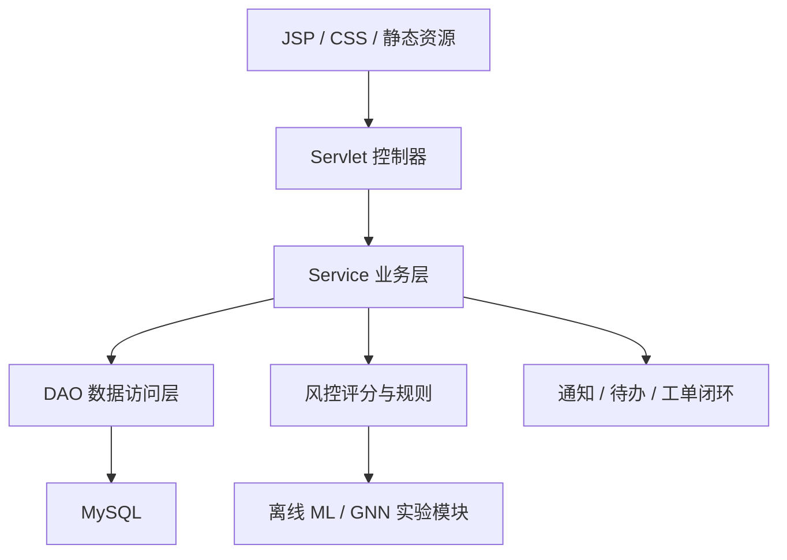

# 系统架构

iBank 采用传统 Java Web 分层架构，优先保证课程项目可运行、可解释、可展示。

## 分层

## 主要模块

- 客户账户：账户列表、余额、默认账户、冻结金额和状态。
- 交易链路：存款、取款、转账、缴费、流水、限额校验、交易后通知。
- 月账单与报表：按日、月、年聚合收支，支持导出和打印。
- 理财业务：风险测评、产品适配、申购、赎回、持仓收益模拟。
- 风控中心：规则阈值、异常事件、图谱展示、模型评分落库。
- 消息闭环：客户通知、后台待办、工单处理、业务处理进度。
- 后台运营：客户、交易、产品、风控、调账、审计、权限角色。
- AI 助手：通过本地 LLM 服务提供解释型问答，不默认外传银行数据。

## 设计原则

- 数据库优先保持稳定，新增功能尽量复用现有表和服务。
- 交易类操作必须经过余额、状态、限额、风控、审计链路。
- 前端不引入大型框架，统一使用 JSP + `main.css`。
- 算法能力采用离线批量评分优先，降低远程服务不稳定对主系统的影响。

