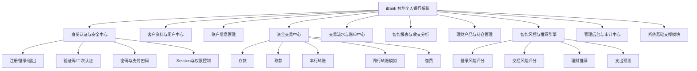
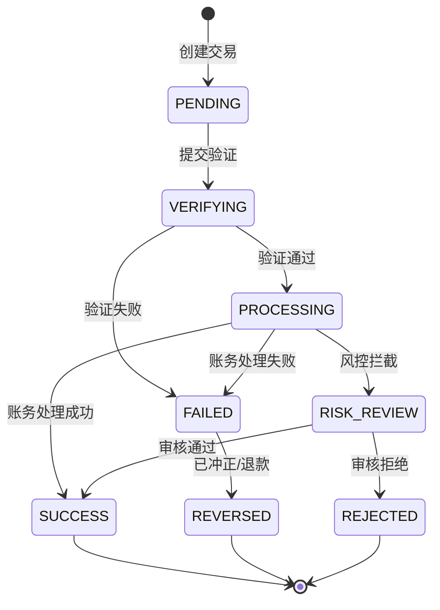
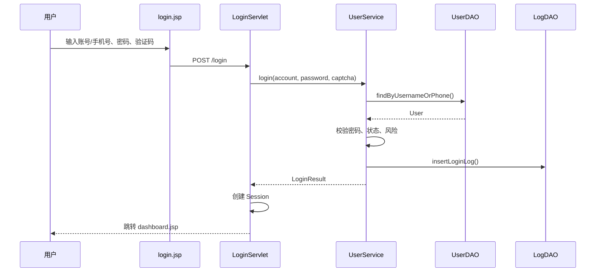
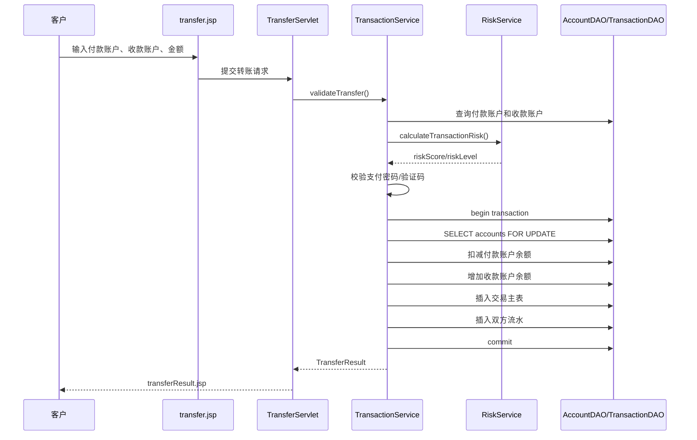
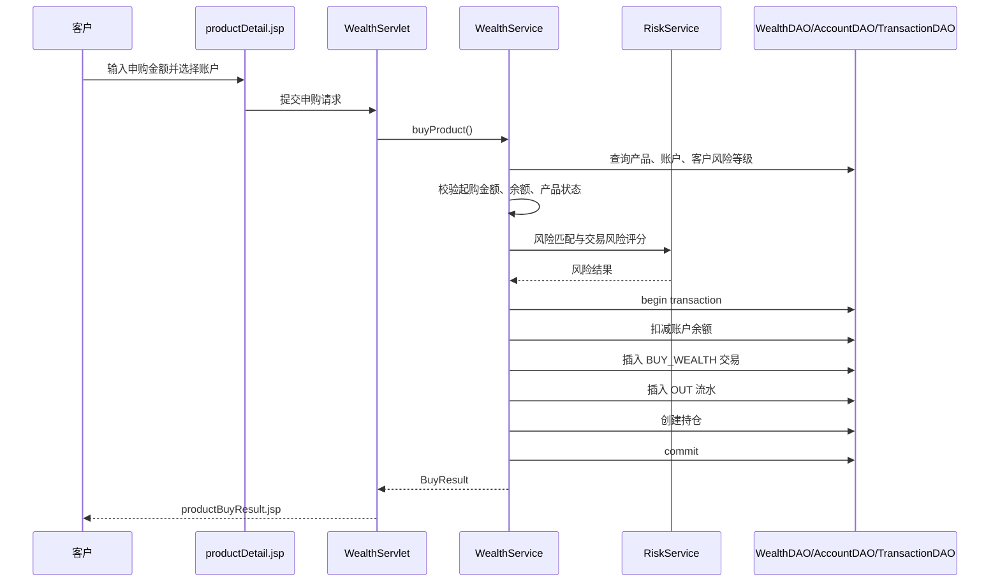
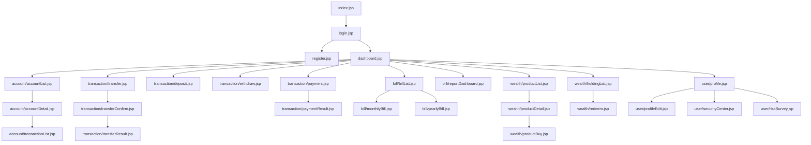
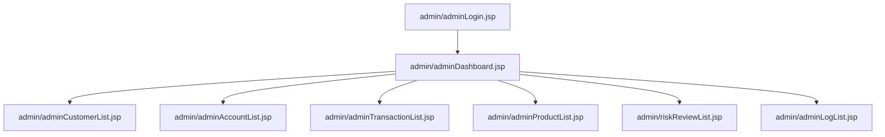

# iBank 智能个人银行系统：系统功能分解与业务分析

> 文档版本：V1.0  
> 编制日期：2026-05-16  
> 项目定位：基于 Java Web + Tomcat 9 + MySQL 的高质量个人银行综合业务系统原型  
> 开发模式：独立全栈开发，兼顾课程实验交付、业务完整性、算法特色与可维护性

---

## 0. 文档目标

本文件用于在正式编码前完成系统功能范围、业务逻辑、用例边界、页面结构、数据依赖、算法嵌入点和验收标准的系统化梳理。

本项目不按“页面堆砌式作业”设计，而按一个小型但完整的个人银行业务系统设计。系统需要覆盖：

1. 用户身份认证与安全控制；
2. 客户资料与账户管理；
3. 存款、取款、转账、缴费等资金交易；
4. 交易流水、账单、报表、导出、打印；
5. 理财产品、申购、赎回、持仓收益；
6. 管理后台、审计日志、风险事件；
7. 登录风险评分、交易风险评分、收支分析、理财推荐等算法特色。

最终目标是形成一个**业务闭环完整、数据库结构清晰、页面流转明确、前后端可联通、核心交易可追溯、具备算法亮点**的个人银行综合业务系统。

---

## 1. 项目基准与设计原则

### 1.1 实验基准要求

实验文件要求开发“个人银行综合业务系统的原型”，基础功能包括：

| 实验功能模块 | 原始要求 | 本项目扩展方向 |
|---|---|---|
| 用户身份认证 | 手机号/账号登录、密码验证、短信验证码/人脸识别二次验证 | 增加登录失败锁定、支付密码、登录风险评分、Session 拦截、角色权限 |
| 账户信息管理 | 查看账户余额、交易明细、开户行、账户类型、修改预留信息 | 增加账户状态、默认账户、模拟开户、资料脱敏、账户安全评分 |
| 交易处理 | 存款、取款、转账、本行/跨行、缴费 | 增加交易状态机、数据库事务、冲正/退款、风控评分、交易审核 |
| 账单与报表 | 日/月/年账单、导出、打印、收支可视化 | 增加资产总览、消费结构、预算预警、支出预测、图表分析 |
| 理财业务 | 产品查看、申购、赎回、持仓收益 | 增加风险匹配、推荐算法、收益计算、产品后台管理 |

实验还要求提交系统界面导航图、界面原型图、E-R 模型、物理数据模型、表示层文件、控制层文件、业务层文件、DAO 文件和其他辅助文件。因此本系统的功能设计必须天然对应 Java Web 的分层架构。

### 1.2 系统设计原则

#### 原则一：以资金闭环为核心

银行系统的核心不是“用户表 + 页面菜单”，而是：

```text
身份确认 → 账户归属确认 → 业务校验 → 交易生成 → 余额变化 → 流水落账 → 日志审计 → 结果反馈
```

所有资金类业务都必须生成交易记录和账户流水，不能只修改账户余额。

#### 原则二：核心业务真实化，外部接口模拟化

| 类别 | 处理方式 |
|---|---|
| 核心账户余额 | 必须真实更新数据库 |
| 交易流水 | 必须真实生成，支持查询和报表统计 |
| 转账事务 | 必须使用数据库事务控制 |
| 短信验证码 | 系统内模拟生成，不接真实短信平台 |
| 人脸识别 | 作为模拟二次认证入口，不接真实模型 |
| 跨行清算 | 用状态流转模拟，不接真实银行网络 |
| 打印导出 | 浏览器打印 + CSV/Excel 风格导出即可 |

#### 原则三：算法必须嵌入业务流程

算法不做孤立展示页，而应嵌入登录、转账、报表、理财等真实场景。

| 算法模块 | 嵌入业务点 | 业务价值 |
|---|---|---|
| 登录风险评分 | 登录时计算 | 判断是否需要验证码/二次认证/锁定 |
| 交易风险评分 | 转账、缴费、理财申购前计算 | 判断是否放行、增强验证或进入审核 |
| 异常交易检测 | 交易完成后记录风险事件 | 发现高频、大额、夜间、新收款人等异常 |
| 收支分析 | 月账单、报表中心 | 自动统计消费结构 |
| 支出预测 | 报表中心 | 使用移动平均预测下月支出 |
| 理财推荐 | 理财产品列表/推荐中心 | 根据风险等级、期限和金额推荐产品 |

#### 原则四：一个月独立开发，范围必须分级

系统范围分为：

| 层级 | 含义 | 开发策略 |
|---|---|---|
| P0 核心闭环 | 没有它系统不成立 | 必须优先完成 |
| P1 完整业务 | 能体现银行综合系统 | 作为主版本完成 |
| P2 亮点增强 | 算法、后台、可视化、体验优化 | 分阶段实现，确保可演示 |
| P3 远期扩展 | 信用卡、贷款、真实短信、人脸识别等 | 暂不纳入本期 |

---

## 2. 系统总体功能架构

### 2.1 顶层功能域

系统建议划分为 10 个功能域：

```text
F01 身份认证与安全中心
F02 客户资料与用户中心
F03 账户信息管理
F04 资金交易中心
F05 交易流水与账单中心
F06 智能报表与收支分析
F07 理财产品与持仓管理
F08 智能风控与推荐引擎
F09 管理后台与审计中心
F10 系统基础支撑模块
```

### 2.2 功能架构图



### 2.3 业务主链路

系统的主业务链路如下：

```text
用户注册/登录
    ↓
客户资料建立
    ↓
账户开立/账户查看
    ↓
资金交易：存款、取款、转账、缴费、理财申购、理财赎回
    ↓
交易主记录 + 账户流水 + 操作日志
    ↓
账单统计 + 报表分析 + 风险分析
    ↓
管理员审计、交易监控、风险事件处理
```

---

## 3. 系统参与者分析

### 3.1 主要参与者

| 参与者 | 描述 | 主要目标 |
|---|---|---|
| 普通客户 Customer | 使用个人银行业务的终端用户 | 管理账户、完成交易、查看账单、购买理财 |
| 银行管理员 Admin | 系统后台管理人员 | 管理客户、账户、理财产品、交易和日志 |
| 风控审核员 RiskAdmin | 可与管理员合并 | 审核高风险交易、查看风险事件 |
| 系统服务 System | 系统自动任务和算法服务 | 生成验证码、计算风险、统计报表、处理超时交易 |

### 3.2 权限边界

| 功能 | 未登录用户 | 普通客户 | 管理员 |
|---|---:|---:|---:|
| 访问首页/登录页 | 是 | 是 | 是 |
| 注册账户 | 是 | 否 | 否 |
| 查看本人账户 | 否 | 是 | 可查看所有 |
| 办理本人交易 | 否 | 是 | 否，管理员不直接代办客户交易 |
| 修改本人预留信息 | 否 | 是 | 可辅助修改或冻结 |
| 查看本人账单 | 否 | 是 | 可查看全部交易统计 |
| 理财申购/赎回 | 否 | 是 | 否 |
| 产品维护 | 否 | 否 | 是 |
| 冻结/解冻账户 | 否 | 否 | 是 |
| 审核风险交易 | 否 | 否 | 是 |
| 查看日志 | 否 | 本人部分可见 | 全部可见 |

### 3.3 权限设计结论

系统中至少需要两种角色：

```text
CUSTOMER：普通客户
ADMIN：系统管理员
```

如需强调风控特色，可增加：

```text
RISK_ADMIN：风控审核员
```

但为了独立开发可控，V1.0 中可以让 ADMIN 同时承担后台管理和风控审核职责。

---

## 4. F01 身份认证与安全中心

### 4.1 模块目标

解决“谁在使用系统”“是否可信”“是否有权限访问业务”的问题。该模块是全部业务的前置条件。

### 4.2 子功能分解

| 编号 | 子功能 | 功能说明 | 优先级 |
|---|---|---|---|
| F01-01 | 用户注册 | 手机号、用户名、密码、确认密码、验证码 | P0 |
| F01-02 | 用户登录 | 支持用户名/手机号 + 密码登录 | P0 |
| F01-03 | 登录验证码 | 登录页面图形/数字验证码，防止暴力尝试 | P1 |
| F01-04 | 登录失败锁定 | 连续失败 N 次临时锁定账号 | P1 |
| F01-05 | Session 管理 | 登录后保存用户身份，未登录拦截 | P0 |
| F01-06 | 退出登录 | 销毁 Session，返回登录页 | P0 |
| F01-07 | 修改登录密码 | 校验原密码后修改 | P1 |
| F01-08 | 设置支付密码 | 转账、缴费、理财操作使用 | P0 |
| F01-09 | 修改支付密码 | 原支付密码 + 验证码 | P1 |
| F01-10 | 二次验证 | 敏感交易触发短信验证码/人脸模拟 | P0 |
| F01-11 | 登录日志 | 成功/失败登录均记录 | P1 |
| F01-12 | 登录风险评分 | 根据时间、设备、失败次数等计算风险 | P2 |

### 4.3 页面与接口建议

| 页面/Servlet | 文件名建议 | 功能 |
|---|---|---|
| 登录页 | `login.jsp` | 输入账号/手机号、密码、验证码 |
| 注册页 | `register.jsp` | 用户注册 |
| 找回密码页 | `resetPassword.jsp` | 模拟找回密码 |
| 二次验证页 | `verifyCode.jsp` | 输入短信验证码或模拟人脸认证 |
| 修改密码页 | `changePassword.jsp` | 修改登录密码 |
| 支付密码设置页 | `setPayPassword.jsp` | 设置或修改支付密码 |
| 登录控制器 | `LoginServlet` | 处理登录请求 |
| 注册控制器 | `RegisterServlet` | 处理注册请求 |
| 退出控制器 | `LogoutServlet` | 处理退出 |
| 验证码控制器 | `VerifyCodeServlet` | 生成和校验验证码 |

### 4.4 登录主流程

```text
1. 用户进入 login.jsp。
2. 输入账号/手机号、密码和验证码。
3. Servlet 接收请求。
4. 校验验证码是否正确。
5. 根据 username 或 phone 查询用户。
6. 判断用户是否存在。
7. 判断用户状态是否为 NORMAL。
8. 校验密码 hash。
9. 计算登录风险评分。
10. 若低风险，登录成功。
11. 若中风险，要求二次验证。
12. 若高风险，临时锁定或拒绝登录。
13. 写入登录日志。
14. 创建 Session，保存 userId、role、customerId。
15. 跳转 dashboard.jsp。
```

### 4.5 异常流程

| 场景 | 系统处理 |
|---|---|
| 用户不存在 | 返回“账号或密码错误”，不暴露账号是否存在 |
| 密码错误 | 失败次数 +1，写入登录日志 |
| 连续失败超过阈值 | 临时锁定账号，例如 15 分钟 |
| 验证码错误 | 直接返回，不校验密码 |
| 账号被冻结 | 提示账户不可用，联系管理员 |
| 登录风险高 | 要求验证码/二次认证或拒绝 |

### 4.6 算法嵌入：登录风险评分

#### 输入特征

| 特征 | 说明 | 分值示例 |
|---|---|---:|
| 登录失败次数 | 最近 30 分钟失败次数 | 每次 +10，最高 30 |
| 新设备登录 | User-Agent 未出现过 | +20 |
| 异常时段 | 00:00-05:00 登录 | +15 |
| IP 异常 | 与最近登录 IP 差异较大 | +15 |
| 管理员账号 | 高权限角色登录 | +10 |

#### 评分公式

```text
loginRiskScore = failedScore + newDeviceScore + timeScore + ipScore + roleScore
```

#### 处理规则

| 分数 | 风险等级 | 处理动作 |
|---:|---|---|
| 0-30 | LOW | 正常登录 |
| 31-60 | MEDIUM | 要求验证码或二次认证 |
| 61-80 | HIGH | 二次认证 + 写入风险事件 |
| 81-100 | CRITICAL | 拒绝登录或临时锁定 |

### 4.7 数据依赖

| 表 | 用途 |
|---|---|
| `t_user` | 用户登录账号、手机号、密码 hash、状态、角色 |
| `t_customer` | 普通客户档案 |
| `t_login_log` | 登录成功/失败记录 |
| `t_security_event` | 登录风险事件 |
| `t_verification_code` | 模拟短信验证码记录，可选 |

### 4.8 验收标准

1. 用户可通过手机号或用户名登录；
2. 未登录访问业务页面会被拦截；
3. 退出后不能继续访问个人页面；
4. 密码不以明文存储；
5. 登录失败会记录日志；
6. 连续失败可触发锁定或增强验证；
7. 转账等敏感操作可触发二次验证。

---

## 5. F02 客户资料与用户中心

### 5.1 模块目标

客户资料模块负责管理用户的个人基本信息、联系方式、风险等级和安全设置。它与登录账号不同：

```text
User：系统登录身份
Customer：银行客户档案
Account：客户名下银行账户
```

### 5.2 子功能分解

| 编号 | 子功能 | 功能说明 | 优先级 |
|---|---|---|---|
| F02-01 | 查看个人资料 | 姓名、手机号、邮箱、地址、风险等级 | P0 |
| F02-02 | 修改预留信息 | 修改邮箱、地址、紧急联系人等 | P1 |
| F02-03 | 修改手机号 | 需要二次验证 | P1 |
| F02-04 | 身份信息脱敏 | 手机号、身份证号部分隐藏 | P1 |
| F02-05 | 风险测评 | 填写问卷生成投资风险等级 | P2 |
| F02-06 | 安全中心 | 查看登录记录、修改密码、支付密码 | P1 |
| F02-07 | 个人偏好设置 | 默认账户、理财期限偏好、预算阈值 | P2 |

### 5.3 页面与接口建议

| 页面/Servlet | 文件名建议 | 功能 |
|---|---|---|
| 个人中心 | `profile.jsp` | 查看客户资料 |
| 编辑资料 | `profileEdit.jsp` | 修改预留信息 |
| 安全中心 | `securityCenter.jsp` | 密码、支付密码、登录记录 |
| 风险测评页 | `riskSurvey.jsp` | 投资风险等级评估 |
| 用户资料控制器 | `ProfileServlet` | 处理资料查询与修改 |
| 风险测评控制器 | `RiskSurveyServlet` | 处理问卷和风险等级 |

### 5.4 风险等级设计

| 风险等级 | 中文名称 | 适配理财产品 |
|---|---|---|
| C1 | 保守型 | R1 |
| C2 | 稳健型 | R1-R2 |
| C3 | 平衡型 | R1-R3 |
| C4 | 成长型 | R1-R4 |
| C5 | 进取型 | R1-R5 |

### 5.5 风险测评算法建议

问卷可设置 5-8 个问题，每题 1-5 分，例如：

1. 可承受本金亏损比例；
2. 投资经验；
3. 投资期限偏好；
4. 收益目标；
5. 流动性需求；
6. 年龄或收入稳定性。

```text
riskLevelScore = sum(questionScore)
```

| 总分 | 客户风险等级 |
|---:|---|
| 0-8 | C1 保守型 |
| 9-14 | C2 稳健型 |
| 15-20 | C3 平衡型 |
| 21-26 | C4 成长型 |
| 27+ | C5 进取型 |

### 5.6 数据依赖

| 表 | 用途 |
|---|---|
| `t_user` | 账号、手机号、状态 |
| `t_customer` | 姓名、证件号脱敏、邮箱、地址、风险等级 |
| `t_customer_preference` | 默认账户、预算阈值、投资偏好，可选 |
| `t_login_log` | 安全中心展示登录记录 |

### 5.7 验收标准

1. 用户可以查看个人资料；
2. 身份证和手机号可以脱敏展示；
3. 用户可以修改邮箱和地址；
4. 修改手机号需要二次验证；
5. 风险测评后能写入客户风险等级；
6. 理财推荐能读取客户风险等级。

---

## 6. F03 账户信息管理

### 6.1 模块目标

账户模块负责管理客户名下银行账户，支持余额查看、账户详情、账户状态、交易明细入口、默认账户等。

### 6.2 账户与用户的关系

```text
一个 User 对应一个 Customer
一个 Customer 可以拥有多个 Account
一个 Account 可以产生多条 LedgerEntry
```

### 6.3 子功能分解

| 编号 | 子功能 | 功能说明 | 优先级 |
|---|---|---|---|
| F03-01 | 账户列表 | 展示当前客户名下所有账户 | P0 |
| F03-02 | 账户详情 | 展示账号、开户行、类型、余额、状态 | P0 |
| F03-03 | 余额查看 | 可用余额、冻结余额、总余额 | P0 |
| F03-04 | 最近交易 | 展示最近 N 条账户流水 | P0 |
| F03-05 | 交易明细入口 | 从账户详情进入流水页面 | P0 |
| F03-06 | 设置默认账户 | 交易和缴费默认选中 | P1 |
| F03-07 | 模拟开户申请 | 申请新账户，可自动开立或管理员审批 | P2 |
| F03-08 | 账户状态展示 | 正常、冻结、销户、挂失 | P1 |
| F03-09 | 账户安全评分 | 根据状态、交易风险、登录风险计算 | P2 |

### 6.4 账户类型建议

| 类型代码 | 类型名称 | 是否纳入 V1.0 | 说明 |
|---|---|---|---|
| SAVING | 储蓄账户/活期账户 | 是 | 核心交易账户 |
| CURRENT | 活期结算账户 | 可与 SAVING 合并 | 简化处理 |
| FIXED | 定期账户 | 可选 | 可作为扩展 |
| WEALTH | 理财资金账户 | 不单独建 | 理财直接绑定活期账户 |
| CREDIT | 信用卡账户 | 否 | 信用卡逻辑复杂，暂不纳入 |

### 6.5 页面与接口建议

| 页面/Servlet | 文件名建议 | 功能 |
|---|---|---|
| 账户列表页 | `accountList.jsp` | 展示所有账户 |
| 账户详情页 | `accountDetail.jsp` | 展示单个账户信息 |
| 最近流水页 | `transactionList.jsp` | 查看账户流水 |
| 开户申请页 | `openAccount.jsp` | 模拟开户，可选 |
| 账户控制器 | `AccountServlet` | 查询账户列表/详情 |
| 开户控制器 | `OpenAccountServlet` | 处理开户申请，可选 |

### 6.6 业务规则

| 规则编号 | 规则内容 |
|---|---|
| ACC-R01 | 用户只能查看本人名下账户，不能通过 URL 参数访问他人账户 |
| ACC-R02 | 账户号、开户行、账户类型、开户日期不可由客户自行修改 |
| ACC-R03 | 账户余额不能手工修改，只能由资金交易产生变化 |
| ACC-R04 | 冻结账户不能进行转账、取款、缴费、理财申购 |
| ACC-R05 | 销户账户只能查看历史记录，不能发起交易 |
| ACC-R06 | 每个客户可设置一个默认付款账户 |

### 6.7 数据依赖

| 表 | 用途 |
|---|---|
| `t_account` | 账户主数据、余额、状态 |
| `t_customer` | 账户所属客户 |
| `t_ledger_entry` | 最近流水 |
| `t_account_application` | 开户申请，可选 |

### 6.8 验收标准

1. 登录用户只能看到自己的账户；
2. 账户列表可以展示余额、开户行、账户类型和状态；
3. 账户详情可以进入交易明细；
4. 冻结账户不可用于交易；
5. 默认账户可以用于转账、缴费、理财申购的表单默认值。

---

## 7. F04 资金交易中心

### 7.1 模块目标

资金交易中心是整个系统的核心模块，负责存款、取款、转账、缴费、理财申购、理财赎回等会导致资金变动的业务。

### 7.2 交易类型总表

| 交易类型代码 | 中文名称 | 资金方向 | 是否产生流水 | 是否需要支付密码 | 是否需要风控 |
|---|---|---|---|---|---|
| DEPOSIT | 存款 | IN | 是 | 否/柜面模拟 | 低 |
| WITHDRAW | 取款 | OUT | 是 | 是 | 中 |
| TRANSFER_INNER | 本行转账 | OUT + IN | 是，双方流水 | 是 | 高 |
| TRANSFER_OUTER | 跨行转账 | OUT | 是 | 是 | 高 |
| PAYMENT | 缴费 | OUT | 是 | 是 | 中 |
| BUY_WEALTH | 理财申购 | OUT | 是 | 是 | 中/高 |
| REDEEM_WEALTH | 理财赎回 | IN | 是 | 是/确认 | 中 |
| REFUND | 退款/冲正 | IN | 是 | 否 | 中 |

### 7.3 交易状态机



### 7.4 资金交易通用流程

```text
1. 用户选择交易类型。
2. 输入交易信息：账户、金额、对方信息、备注。
3. 控制层接收请求。
4. 校验用户是否登录。
5. 校验账户是否属于当前用户。
6. 校验账户状态是否正常。
7. 校验金额格式和最小/最大金额。
8. 校验余额是否充足。
9. 调用风控引擎计算 riskScore。
10. 根据风险等级决定验证方式。
11. 校验支付密码/验证码。
12. 开启数据库事务。
13. 锁定账户行。
14. 更新账户余额。
15. 插入交易主记录。
16. 插入账户流水。
17. 插入业务扩展记录，如缴费、理财持仓。
18. 插入操作日志。
19. 提交事务。
20. 返回交易结果页。
```

### 7.5 F04-01 存款业务

#### 功能定位

真实网银通常不支持直接现金存款，但实验要求包含存款，因此本系统将存款设计为“柜面模拟业务”或“系统模拟入金”。

#### 页面流程

```text
accountList.jsp → deposit.jsp → TransactionServlet → transactionResult.jsp
```

#### 主流程

1. 用户选择入账账户；
2. 输入存款金额和备注；
3. 系统校验账户归属和账户状态；
4. 开启事务；
5. 增加账户余额；
6. 生成交易记录 `DEPOSIT`；
7. 生成收入方向流水；
8. 返回结果。

#### 验收标准

1. 存款后账户余额增加；
2. 流水中出现收入记录；
3. 交易详情可查询；
4. 账单统计可统计该收入。

### 7.6 F04-02 取款业务

#### 功能定位

取款同样作为“柜面模拟业务”，但由于资金流出，需要校验支付密码和余额。

#### 主流程

1. 用户选择取款账户；
2. 输入金额；
3. 校验账户状态；
4. 校验余额是否充足；
5. 校验支付密码；
6. 调用风控评分；
7. 低/中风险放行，高风险拦截；
8. 开启事务，扣减余额，生成交易与流水。

#### 业务规则

| 规则编号 | 规则内容 |
|---|---|
| WDR-R01 | 取款金额必须大于 0 |
| WDR-R02 | 取款金额不能超过可用余额 |
| WDR-R03 | 冻结账户不可取款 |
| WDR-R04 | 单日累计取款可设置限额 |

### 7.7 F04-03 本行转账业务

#### 功能定位

本行转账是系统最重要的核心用例，必须实现完整资金闭环。

#### 页面流程

```text
accountList.jsp
    ↓
transfer.jsp
    ↓
transferConfirm.jsp
    ↓
verifyCode.jsp / payPassword
    ↓
TransferServlet
    ↓
transferResult.jsp
```

#### 主流程

```text
1. 用户选择付款账户。
2. 输入收款账户号、金额、备注。
3. 系统校验付款账户属于当前用户。
4. 系统校验付款账户状态正常。
5. 系统校验收款账户存在且状态正常。
6. 系统校验付款账户余额充足。
7. 系统校验是否超过单笔限额和日累计限额。
8. 风控引擎计算交易风险评分。
9. 根据风险等级要求支付密码、短信验证码或进入审核。
10. 用户确认交易信息。
11. 开启数据库事务。
12. 使用 SELECT ... FOR UPDATE 锁定付款账户和收款账户。
13. 扣减付款账户余额。
14. 增加收款账户余额。
15. 生成交易主记录。
16. 生成付款方 OUT 流水。
17. 生成收款方 IN 流水。
18. 写入操作日志和风险记录。
19. 提交事务。
20. 返回交易结果。
```

#### 数据一致性要求

本行转账必须保证以下原子性：

```text
扣款成功 + 入账成功 + 交易记录成功 + 双方流水成功
```

任何一步失败都必须回滚。

#### 异常流程

| 场景 | 系统处理 |
|---|---|
| 收款账户不存在 | 拒绝交易，不扣款 |
| 付款账户余额不足 | 拒绝交易，不生成成功交易 |
| 支付密码错误 | 交易不执行，记录失败 |
| 风险评分过高 | 进入 RISK_REVIEW 或直接拒绝 |
| 事务中途异常 | ROLLBACK，返回失败页 |
| 收款账户被冻结 | 拒绝或进入人工审核 |

#### 验收标准

1. 付款账户余额减少；
2. 收款账户余额增加；
3. 交易主表有一条成功记录；
4. 流水表有两条记录，一条 OUT，一条 IN；
5. 交易详情能展示双方账户、金额、时间、状态；
6. 报表和账单能统计该笔交易；
7. 高风险交易能触发增强验证或审核。

### 7.8 F04-04 跨行转账模拟业务

#### 功能定位

跨行转账不接入真实银行网络，通过“外部银行账户信息 + 交易状态流转”模拟。

#### 页面流程

```text
interbankTransfer.jsp → transferConfirm.jsp → TransferServlet → transferResult.jsp
```

#### 主流程

1. 用户选择付款账户；
2. 输入收款银行、收款账户名、收款账号、金额；
3. 校验付款账户归属、状态和余额；
4. 计算风险评分；
5. 高风险进入审核；
6. 开启事务，扣减付款账户余额；
7. 生成交易状态为 `PROCESSING`；
8. 生成付款方 OUT 流水；
9. 管理员或模拟任务将交易改为 `SUCCESS` 或 `FAILED`；
10. 若失败，生成 `REFUND` 退款交易并返还余额。

#### 状态处理

| 状态 | 含义 |
|---|---|
| PROCESSING | 已扣款，等待模拟清算 |
| SUCCESS | 跨行转账成功 |
| FAILED | 跨行转账失败 |
| REVERSED | 失败后已退款 |

#### 验收标准

1. 跨行转账能生成处理中状态；
2. 管理员可处理成功或失败；
3. 失败后能退款；
4. 退款也必须生成流水和日志。

### 7.9 F04-05 缴费业务

#### 功能定位

缴费包括水费、电费、燃气费、话费。缴费本质是付款账户向缴费机构支出资金。

#### 页面流程

```text
payment.jsp → paymentConfirm.jsp → PaymentServlet → paymentResult.jsp
```

#### 子功能

| 子功能 | 说明 |
|---|---|
| 水费缴费 | 输入户号、缴费金额、月份 |
| 电费缴费 | 输入户号、缴费金额、月份 |
| 燃气费缴费 | 输入户号、缴费金额、月份 |
| 话费充值 | 输入手机号、充值金额 |
| 缴费记录查询 | 查询历史缴费记录 |

#### 主流程

1. 用户选择缴费类型；
2. 输入缴费户号、机构、金额；
3. 选择付款账户；
4. 校验账户归属、状态和余额；
5. 校验支付密码；
6. 扣减账户余额；
7. 生成 `PAYMENT` 交易；
8. 生成 OUT 流水；
9. 生成缴费扩展记录；
10. 返回缴费成功。

#### 验收标准

1. 缴费后账户余额减少；
2. 交易流水中显示缴费类型；
3. 缴费记录表保存户号、缴费机构、月份等；
4. 月账单可将缴费归入生活缴费分类。

---

## 8. F05 交易流水与账单中心

### 8.1 模块目标

该模块负责沉淀和展示所有资金交易的历史记录。账单不是独立生成的假数据，而是由交易流水聚合得到。

```text
Transaction：交易主记录，表示一笔业务
LedgerEntry：账户流水，表示某个账户因交易发生的资金方向变化
Bill：按时间和类型聚合的统计结果，不一定需要永久表
```

### 8.2 子功能分解

| 编号 | 子功能 | 功能说明 | 优先级 |
|---|---|---|---|
| F05-01 | 账户流水查询 | 按账户查询所有流水 | P0 |
| F05-02 | 流水条件筛选 | 按时间、类型、金额、方向筛选 | P0 |
| F05-03 | 分页查询 | 支持分页展示 | P1 |
| F05-04 | 交易详情 | 查看单笔交易完整信息 | P0 |
| F05-05 | 日账单 | 某日收入、支出、明细 | P1 |
| F05-06 | 月账单 | 月度收入、支出、分类统计 | P0 |
| F05-07 | 年账单 | 年度汇总和趋势 | P1 |
| F05-08 | 账单导出 | CSV/Excel 风格导出 | P1 |
| F05-09 | 账单打印 | 浏览器打印 | P1 |
| F05-10 | 大额交易查询 | 高于阈值的交易列表 | P2 |

### 8.3 页面与接口建议

| 页面/Servlet | 文件名建议 | 功能 |
|---|---|---|
| 流水列表页 | `transactionList.jsp` | 查询账户流水 |
| 交易详情页 | `transactionDetail.jsp` | 单笔交易详情 |
| 账单查询页 | `billList.jsp` | 日/月/年账单入口 |
| 月账单页 | `monthlyBill.jsp` | 月度统计 |
| 年账单页 | `yearlyBill.jsp` | 年度统计 |
| 流水控制器 | `TransactionQueryServlet` | 查询流水 |
| 账单控制器 | `BillServlet` | 生成账单 |
| 导出控制器 | `ExportBillServlet` | 导出账单 |

### 8.4 账单生成逻辑

```text
输入：customerId/accountId/dateRange
    ↓
查询 t_ledger_entry
    ↓
关联 t_transaction 得到交易类型
    ↓
按 direction 统计收入/支出
    ↓
按 txn_type 统计分类
    ↓
按日期分组生成趋势
    ↓
返回 BillDTO / ReportDTO
```

### 8.5 账单指标

| 指标 | 计算方式 |
|---|---|
| 本月收入 | `direction = IN` 的金额合计 |
| 本月支出 | `direction = OUT` 的金额合计 |
| 净流入 | 收入 - 支出 |
| 转账支出 | `txn_type = TRANSFER_*` 且 `direction = OUT` |
| 生活缴费 | `txn_type = PAYMENT` |
| 理财申购 | `txn_type = BUY_WEALTH` |
| 理财赎回 | `txn_type = REDEEM_WEALTH` |
| 大额交易 | 金额超过设定阈值 |

### 8.6 数据依赖

| 表 | 用途 |
|---|---|
| `t_transaction` | 交易主记录 |
| `t_ledger_entry` | 账户资金流水 |
| `t_bill_payment` | 缴费业务详情 |
| `t_wealth_holding` | 理财持仓关联 |
| `t_account` | 账户信息和余额 |

### 8.7 验收标准

1. 用户可以按账户查看流水；
2. 可按时间、类型、金额筛选；
3. 流水中展示交易后余额；
4. 单笔交易可以查看详情；
5. 月账单可以统计收入、支出、净流入；
6. 账单结果与流水数据一致；
7. 可导出或打印账单。

---

## 9. F06 智能报表与收支分析

### 9.1 模块目标

该模块用于展示系统的智能化和可视化能力。它基于账户流水和理财持仓生成资产、收支、消费结构和预算预警。

### 9.2 子功能分解

| 编号 | 子功能 | 功能说明 | 优先级 |
|---|---|---|---|
| F06-01 | 资产总览 | 活期余额、理财本金、理财收益、总资产 | P0 |
| F06-02 | 收支趋势 | 按月展示收入、支出趋势 | P1 |
| F06-03 | 消费结构 | 缴费、转账、取款、理财等占比 | P1 |
| F06-04 | 余额变化曲线 | 根据流水的 balance_after 展示变化 | P2 |
| F06-05 | 大额支出分析 | 展示本月大额支出 | P2 |
| F06-06 | 预算设置 | 设置月度预算 | P2 |
| F06-07 | 预算预警 | 支出接近或超过预算时提醒 | P2 |
| F06-08 | 下月支出预测 | 使用移动平均算法预测 | P2 |
| F06-09 | 财务健康评分 | 综合资产、支出、风险交易生成评分 | P2 |

### 9.3 页面与接口建议

| 页面/Servlet | 文件名建议 | 功能 |
|---|---|---|
| 报表首页 | `reportDashboard.jsp` | 资产和收支总览 |
| 收支分析页 | `incomeExpenseReport.jsp` | 收支趋势图 |
| 消费结构页 | `categoryReport.jsp` | 分类占比 |
| 预算管理页 | `budget.jsp` | 设置预算和查看预警 |
| 报表控制器 | `ReportServlet` | 报表数据查询 |
| 预算控制器 | `BudgetServlet` | 预算设置 |

### 9.4 收支分类规则

| 分类 | 规则 |
|---|---|
| 收入 | `direction = IN` |
| 转账支出 | `txn_type = TRANSFER_INNER/TRANSFER_OUTER` 且 `direction = OUT` |
| 生活缴费 | `txn_type = PAYMENT` |
| 理财投资 | `txn_type = BUY_WEALTH` |
| 现金取款 | `txn_type = WITHDRAW` |
| 理财赎回 | `txn_type = REDEEM_WEALTH` |
| 退款冲正 | `txn_type = REFUND` |

### 9.5 算法嵌入：支出预测

#### 简单移动平均

```text
预测下月支出 = 最近 3 个月支出的平均值
```

#### 加权移动平均

```text
预测下月支出 = 最近1个月支出 × 0.5 + 最近2个月支出 × 0.3 + 最近3个月支出 × 0.2
```

#### 预算预警规则

| 条件 | 提示 |
|---|---|
| 当前支出 < 预算 70% | 支出正常 |
| 当前支出 ≥ 预算 70% | 接近预算，请关注 |
| 当前支出 ≥ 预算 100% | 已超过预算 |
| 预测支出 ≥ 预算 120% | 下月可能超支 |

### 9.6 算法嵌入：财务健康评分

```text
financeHealthScore = 
    assetScore * 0.3
  + budgetScore * 0.25
  + riskTransactionScore * 0.25
  + wealthDiversificationScore * 0.2
```

| 分数 | 评价 |
|---:|---|
| 80-100 | 财务状态良好 |
| 60-79 | 财务状态稳定 |
| 40-59 | 需要关注支出和风险 |
| 0-39 | 财务风险较高 |

### 9.7 验收标准

1. 报表数据来自真实流水；
2. 能展示总资产、收入、支出、净流入；
3. 能生成消费结构分类；
4. 能根据最近几个月支出预测下月支出；
5. 能对预算超支给出预警。

---

## 10. F07 理财产品与持仓管理

### 10.1 模块目标

理财模块负责产品展示、产品筛选、申购、赎回、持仓收益和推荐。理财业务必须和账户资金、风险测评、交易流水打通。

### 10.2 子功能分解

| 编号 | 子功能 | 功能说明 | 优先级 |
|---|---|---|---|
| F07-01 | 理财产品列表 | 查看在售产品 | P0 |
| F07-02 | 产品详情 | 查看收益率、期限、风险、起购金额 | P0 |
| F07-03 | 产品筛选 | 按风险等级、期限、收益率筛选 | P1 |
| F07-04 | 智能推荐 | 根据用户风险和偏好推荐产品 | P2 |
| F07-05 | 理财申购 | 使用账户余额购买理财 | P0 |
| F07-06 | 风险匹配校验 | 用户风险等级必须匹配产品风险 | P0 |
| F07-07 | 持仓查询 | 查看本金、收益、状态 | P0 |
| F07-08 | 收益计算 | 根据年化收益率和持有天数计算 | P1 |
| F07-09 | 理财赎回 | 赎回本金和收益到账户 | P0 |
| F07-10 | 产品管理 | 管理员新增、修改、上下架产品 | P1 |

### 10.3 产品字段建议

| 字段 | 含义 |
|---|---|
| productId | 产品 ID |
| productName | 产品名称 |
| productCode | 产品编号 |
| riskLevel | R1-R5 |
| expectedRate | 预期年化收益率 |
| periodDays | 产品期限 |
| minAmount | 起购金额 |
| maxAmount | 购买上限 |
| status | ON_SALE / OFF_SALE |
| description | 产品说明 |

### 10.4 理财申购流程

```text
1. 用户进入理财产品列表。
2. 查看产品详情。
3. 系统读取用户风险等级。
4. 用户输入申购金额并选择付款账户。
5. 校验产品是否在售。
6. 校验申购金额是否达到起购金额。
7. 校验账户余额是否充足。
8. 校验客户风险等级是否匹配产品风险等级。
9. 调用交易风险评分。
10. 校验支付密码/验证码。
11. 开启事务。
12. 扣减账户余额。
13. 生成 BUY_WEALTH 交易主记录。
14. 生成 OUT 流水。
15. 创建理财持仓。
16. 写入操作日志。
17. 返回申购结果。
```

### 10.5 理财赎回流程

```text
1. 用户进入持仓列表。
2. 选择某个持仓。
3. 系统计算当前收益。
4. 用户确认赎回。
5. 校验持仓状态是否可赎回。
6. 开启事务。
7. 本金 + 收益 转入账户余额。
8. 生成 REDEEM_WEALTH 交易。
9. 生成 IN 流水。
10. 更新持仓状态为 REDEEMED。
11. 写入操作日志。
12. 返回赎回结果。
```

### 10.6 收益计算

```text
currentIncome = principal × expectedRate / 365 × holdingDays
redeemAmount = principal + currentIncome
```

说明：课程原型中可采用单利计算，不实现复杂净值型产品。

### 10.7 风险匹配规则

| 客户风险等级 | 可购买产品风险等级 |
|---|---|
| C1 保守型 | R1 |
| C2 稳健型 | R1-R2 |
| C3 平衡型 | R1-R3 |
| C4 成长型 | R1-R4 |
| C5 进取型 | R1-R5 |

### 10.8 验收标准

1. 用户可以查看理财产品列表；
2. 用户可以查看产品详情；
3. 用户申购理财会扣减账户余额；
4. 申购成功后生成持仓；
5. 申购交易能在流水和账单中出现；
6. 用户赎回后本金和收益进入账户；
7. 风险等级不匹配时给出提示或拦截；
8. 系统能给出推荐产品和推荐理由。

---

## 11. F08 智能风控与推荐引擎

### 11.1 模块目标

这是本项目的个人特色模块。它不只作为展示页存在，而嵌入登录、交易、理财和报表业务。

### 11.2 子功能分解

| 编号 | 子功能 | 功能说明 | 优先级 |
|---|---|---|---|
| F08-01 | 登录风险评分 | 登录时识别异常登录 | P2 |
| F08-02 | 交易风险评分 | 转账、取款、缴费、理财前计算风险 | P0/P2 |
| F08-03 | 异常交易检测 | 检测大额、夜间、高频、新收款人 | P2 |
| F08-04 | 风险事件记录 | 写入风险事件表 | P2 |
| F08-05 | 风险交易拦截 | 高风险交易进入审核或拒绝 | P2 |
| F08-06 | 理财推荐算法 | 推荐合适产品 | P2 |
| F08-07 | 推荐理由生成 | 给出可解释推荐原因 | P2 |
| F08-08 | 支出预测算法 | 预测下月支出 | P2 |
| F08-09 | 财务健康评分 | 生成用户财务评分 | P2 |

### 11.3 交易风险评分算法

#### 11.3.1 输入特征

| 特征 | 业务含义 | 示例评分 |
|---|---|---:|
| 金额异常 | 本次金额是否显著高于历史均值 | 0-25 |
| 首次收款人 | 是否第一次向该账户转账 | 0/15 |
| 异常时间 | 是否夜间或非常用时间 | 0/10 |
| 高频交易 | 短时间内交易次数过多 | 0-15 |
| 余额占比 | 交易金额占账户余额比例过高 | 0-15 |
| 登录风险 | 本次登录是否高风险 | 0-10 |
| 账户状态 | 账户是否存在风险标记 | 0-10 |

#### 11.3.2 评分公式

```text
transactionRiskScore =
    amountScore
  + newPayeeScore
  + timeScore
  + frequencyScore
  + balanceRatioScore
  + loginRiskScore
  + accountRiskScore
```

#### 11.3.3 处理规则

| 分数 | 等级 | 处理动作 |
|---:|---|---|
| 0-30 | LOW | 支付密码确认后执行 |
| 31-60 | MEDIUM | 支付密码 + 验证码 |
| 61-80 | HIGH | 进入风险审核 |
| 81-100 | CRITICAL | 拒绝交易并记录风险事件 |

#### 11.3.4 示例

```text
用户平时转账金额：100-500 元
本次转账金额：20000 元
收款人：首次出现
时间：凌晨 2:30
登录设备：新设备
30 分钟内已有 3 笔转账

系统评分：88
处理结果：拒绝交易或进入风险审核
```

### 11.4 金额异常检测

```text
if currentAmount > avgAmountLast30Days * 5:
    amountScore = 25
elif currentAmount > avgAmountLast30Days * 3:
    amountScore = 18
elif currentAmount > avgAmountLast30Days * 2:
    amountScore = 10
else:
    amountScore = 0
```

当用户历史交易较少时，采用固定阈值：

| 金额 | 分数 |
|---:|---:|
| < 1000 | 0 |
| 1000-5000 | 5 |
| 5000-20000 | 15 |
| > 20000 | 25 |

### 11.5 交易频率检测

| 条件 | 分数 |
|---|---:|
| 30 分钟内 1-2 笔 | 0 |
| 30 分钟内 3-5 笔 | 10 |
| 30 分钟内超过 5 笔 | 15 |

### 11.6 理财推荐算法

#### 输入特征

| 特征 | 含义 |
|---|---|
| 用户风险等级 | C1-C5 |
| 产品风险等级 | R1-R5 |
| 可投资金额 | 账户余额或用户输入金额 |
| 期限偏好 | 短期、中期、长期 |
| 收益率 | 产品预期收益率 |
| 起购金额 | 是否适配用户资金 |

#### 推荐评分公式

```text
productScore =
    riskMatchScore * 0.40
  + returnScore * 0.25
  + periodMatchScore * 0.20
  + amountFitScore * 0.15
```

#### 各项评分

| 项 | 评分逻辑 |
|---|---|
| riskMatchScore | 产品风险不超过客户风险等级得高分，超过则低分或排除 |
| returnScore | 收益率越高得分越高，但不能覆盖风险匹配原则 |
| periodMatchScore | 产品期限越符合偏好得分越高 |
| amountFitScore | 起购金额低于可投资金额得分较高 |

#### 推荐理由模板

```text
推荐原因：该产品风险等级为 R2，与您的稳健型风险等级匹配；起购金额 1000 元，低于您的可投资余额；产品期限 90 天，符合您的中短期投资偏好。
```

### 11.7 风险事件表设计建议

| 字段 | 含义 |
|---|---|
| event_id | 风险事件 ID |
| user_id | 用户 ID |
| account_id | 账户 ID |
| event_type | LOGIN_RISK / TXN_RISK / HIGH_FREQUENCY 等 |
| risk_score | 风险分 |
| risk_level | LOW/MEDIUM/HIGH/CRITICAL |
| related_business_id | 关联交易号或登录日志 ID |
| action | PASS / MFA / REVIEW / REJECT |
| detail | 事件详情 |
| created_at | 创建时间 |

### 11.8 验收标准

1. 转账前可计算风险分；
2. 高风险交易不会直接成功；
3. 风险事件可在后台查看；
4. 理财列表能给出推荐产品；
5. 推荐理由可解释；
6. 报表中心可展示支出预测或财务健康评分。

---

## 12. F09 管理后台与审计中心

### 12.1 模块目标

后台模块用于证明系统不仅是单用户 Demo，而是完整信息系统。后台负责客户、账户、交易、理财产品、日志和风险事件管理。

### 12.2 子功能分解

| 编号 | 子功能 | 功能说明 | 优先级 |
|---|---|---|---|
| F09-01 | 管理员登录 | Admin 角色进入后台 | P0 |
| F09-02 | 后台首页 | 统计客户数、账户数、交易数、风险事件 | P1 |
| F09-03 | 客户管理 | 查询客户、查看客户详情 | P1 |
| F09-04 | 账户管理 | 查看账户、冻结/解冻账户 | P1 |
| F09-05 | 交易监控 | 查看所有交易，按状态筛选 | P1 |
| F09-06 | 风险交易审核 | 审核 RISK_REVIEW 状态交易 | P2 |
| F09-07 | 理财产品管理 | 新增、修改、上下架产品 | P1 |
| F09-08 | 登录日志查看 | 查看用户登录记录 | P1 |
| F09-09 | 操作日志查看 | 查看转账、缴费、理财等操作 | P1 |
| F09-10 | 风险事件查看 | 查看风控触发记录 | P2 |

### 12.3 后台页面建议

| 页面/Servlet | 文件名建议 | 功能 |
|---|---|---|
| 后台登录页 | `adminLogin.jsp` | 管理员登录 |
| 后台首页 | `adminDashboard.jsp` | 运营概览 |
| 客户管理 | `adminCustomerList.jsp` | 客户查询 |
| 账户管理 | `adminAccountList.jsp` | 账户冻结/解冻 |
| 交易监控 | `adminTransactionList.jsp` | 全量交易查询 |
| 风险审核 | `riskReviewList.jsp` | 审核高风险交易 |
| 产品管理 | `adminProductList.jsp` | 理财产品维护 |
| 日志管理 | `adminLogList.jsp` | 登录/操作日志 |

### 12.4 风险交易审核流程

```text
1. 交易风控评分为 HIGH。
2. 系统将交易状态设为 RISK_REVIEW。
3. 管理员进入风险审核列表。
4. 查看交易详情、用户历史、风险原因。
5. 管理员选择通过或拒绝。
6. 通过：继续执行交易或完成模拟处理。
7. 拒绝：交易状态改为 REJECTED，必要时退款。
8. 写入审核日志。
```

### 12.5 审计日志设计

审计日志至少包括：

| 日志类型 | 记录内容 |
|---|---|
| 登录日志 | 用户、时间、IP、结果、失败原因 |
| 操作日志 | 用户、操作类型、业务 ID、操作详情 |
| 交易日志 | 交易号、账户、金额、状态变化 |
| 风险日志 | 风险分、风险原因、系统处理动作 |
| 后台日志 | 管理员冻结账户、审核交易、维护产品等 |

### 12.6 验收标准

1. 管理员可登录后台；
2. 管理员能查看客户和账户；
3. 管理员能冻结/解冻账户；
4. 管理员能查看交易列表和详情；
5. 管理员能维护理财产品；
6. 管理员能查看登录日志和操作日志；
7. 高风险交易可进入审核列表。

---

## 13. F10 系统基础支撑模块

### 13.1 模块目标

基础支撑模块不直接面对用户，但支撑项目的可维护性、稳定性和安全性。

### 13.2 子功能分解

| 编号 | 子功能 | 功能说明 | 优先级 |
|---|---|---|---|
| F10-01 | 数据库连接工具 | JDBC 连接 MySQL | P0 |
| F10-02 | DAO 基类/工具 | 统一执行 SQL、关闭资源 | P0 |
| F10-03 | 编码过滤器 | 统一 UTF-8 | P0 |
| F10-04 | 登录过滤器 | 未登录拦截 | P0 |
| F10-05 | 权限过滤器 | Customer/Admin 权限控制 | P0 |
| F10-06 | 密码加密工具 | 生成 hash，校验密码 | P0 |
| F10-07 | 交易号生成器 | 生成唯一交易号 | P0 |
| F10-08 | 金额工具 | BigDecimal 精度处理 | P0 |
| F10-09 | 分页工具 | 列表分页 | P1 |
| F10-10 | 日期工具 | 日期范围计算 | P1 |
| F10-11 | 日志工具 | 写入操作日志 | P1 |
| F10-12 | 异常处理 | 统一错误页面和异常封装 | P1 |

### 13.3 分层结构建议

```text
src/
  com.ibank.bean/        实体类
  com.ibank.dao/         DAO 接口
  com.ibank.dao.impl/    DAO 实现
  com.ibank.service/     Service 接口
  com.ibank.service.impl/Service 实现
  com.ibank.servlet/     Servlet 控制器
  com.ibank.filter/      过滤器
  com.ibank.util/        工具类
  com.ibank.dto/         页面数据传输对象
  com.ibank.enums/       枚举类
```

### 13.4 WebContent 结构建议

```text
WebContent/
  index.jsp
  login.jsp
  register.jsp
  dashboard.jsp

  account/
    accountList.jsp
    accountDetail.jsp
    transactionList.jsp

  transaction/
    transfer.jsp
    transferConfirm.jsp
    transferResult.jsp
    deposit.jsp
    withdraw.jsp
    payment.jsp
    paymentResult.jsp

  bill/
    billList.jsp
    monthlyBill.jsp
    yearlyBill.jsp
    reportDashboard.jsp

  wealth/
    productList.jsp
    productDetail.jsp
    productBuy.jsp
    holdingList.jsp
    redeem.jsp

  user/
    profile.jsp
    profileEdit.jsp
    securityCenter.jsp
    riskSurvey.jsp

  admin/
    adminLogin.jsp
    adminDashboard.jsp
    adminCustomerList.jsp
    adminAccountList.jsp
    adminTransactionList.jsp
    adminProductList.jsp
    riskReviewList.jsp
    adminLogList.jsp

  css/
    style.css
    admin.css

  js/
    common.js
    chart.js

  WEB-INF/
    web.xml
```

### 13.5 验收标准

1. 所有页面 UTF-8 正常；
2. 未登录不能访问业务页面；
3. 普通用户不能访问管理员页面；
4. DAO 层统一使用 PreparedStatement；
5. 资金交易统一使用 Service 层事务控制；
6. 所有金额计算使用 BigDecimal；
7. 页面错误有明确提示，不暴露数据库细节。

---

## 14. 核心用例清单

### 14.1 P0 必须实现用例

| 用例编号 | 用例名称 | 参与者 | 关联模块 | 完整性要求 |
|---|---|---|---|---|
| UC-001 | 用户注册 | 未登录用户 | F01 | 表单、Servlet、Service、DAO、数据库 |
| UC-002 | 用户登录 | 用户 | F01 | 密码校验、Session、日志 |
| UC-003 | 退出登录 | 用户 | F01 | Session 销毁 |
| UC-004 | 查看账户列表 | 客户 | F03 | 查询本人账户 |
| UC-005 | 查看账户详情 | 客户 | F03 | 账户详情 + 最近流水 |
| UC-006 | 存款 | 客户 | F04 | 余额增加 + 交易 + 流水 |
| UC-007 | 取款 | 客户 | F04 | 余额减少 + 支付密码 + 流水 |
| UC-008 | 本行转账 | 客户 | F04/F08 | 双方余额变化 + 双方流水 + 风控 |
| UC-009 | 缴费 | 客户 | F04 | 扣款 + 缴费记录 + 流水 |
| UC-010 | 查询交易流水 | 客户 | F05 | 条件查询 + 分页 |
| UC-011 | 查询月账单 | 客户 | F05 | 收入/支出统计 |
| UC-012 | 查看理财产品 | 客户 | F07 | 产品列表和详情 |
| UC-013 | 理财申购 | 客户 | F07/F04 | 扣款 + 持仓 + 流水 |
| UC-014 | 理财赎回 | 客户 | F07/F04 | 收益计算 + 入账 + 流水 |
| UC-015 | 管理员登录 | 管理员 | F09 | Admin Session |
| UC-016 | 管理理财产品 | 管理员 | F09/F07 | 新增/修改/上下架 |

### 14.2 P1 完整业务用例

| 用例编号 | 用例名称 | 参与者 | 关联模块 |
|---|---|---|---|
| UC-017 | 修改个人资料 | 客户 | F02 |
| UC-018 | 修改登录密码 | 客户 | F01/F02 |
| UC-019 | 设置支付密码 | 客户 | F01 |
| UC-020 | 跨行转账 | 客户 | F04 |
| UC-021 | 账单导出 | 客户 | F05 |
| UC-022 | 账单打印 | 客户 | F05 |
| UC-023 | 查看收支报表 | 客户 | F06 |
| UC-024 | 管理员查看客户 | 管理员 | F09 |
| UC-025 | 冻结/解冻账户 | 管理员 | F09 |
| UC-026 | 查看操作日志 | 管理员 | F09 |

### 14.3 P2 特色增强用例

| 用例编号 | 用例名称 | 参与者 | 关联模块 |
|---|---|---|---|
| UC-027 | 登录风险识别 | 系统 | F08 |
| UC-028 | 交易风险评分 | 系统 | F08 |
| UC-029 | 高风险交易审核 | 管理员 | F09/F08 |
| UC-030 | 理财智能推荐 | 系统 | F08/F07 |
| UC-031 | 支出预测 | 系统 | F06/F08 |
| UC-032 | 财务健康评分 | 系统 | F06/F08 |
| UC-033 | 风险测评 | 客户 | F02/F07 |

---

## 15. 关键业务流程详解

### 15.1 用户登录流程



### 15.2 本行转账流程



### 15.3 理财申购流程



---

## 16. 功能与数据实体映射

| 功能模块 | 核心实体 | 辅助实体 |
|---|---|---|
| 身份认证 | `t_user` | `t_login_log`, `t_verification_code`, `t_security_event` |
| 客户资料 | `t_customer` | `t_customer_preference` |
| 账户管理 | `t_account` | `t_account_application` |
| 存取款 | `t_transaction`, `t_ledger_entry` | `t_operation_log` |
| 转账 | `t_transaction`, `t_ledger_entry`, `t_account` | `t_payee`, `t_security_event` |
| 缴费 | `t_bill_payment`, `t_transaction`, `t_ledger_entry` | `t_operation_log` |
| 账单报表 | `t_ledger_entry`, `t_transaction` | `t_budget` |
| 理财产品 | `t_wealth_product` | `t_wealth_product_log` |
| 理财持仓 | `t_wealth_holding`, `t_transaction`, `t_ledger_entry` | `t_operation_log` |
| 风控算法 | `t_security_event`, `t_risk_rule` | `t_login_log`, `t_transaction` |
| 管理后台 | 多表 | `t_operation_log` |

---

## 17. 页面导航结构

### 17.1 客户端页面导航



### 17.2 管理端页面导航



---

## 18. Servlet 与 Service 映射建议

| 功能 | Servlet | Service | DAO |
|---|---|---|---|
| 登录 | `LoginServlet` | `UserService` | `UserDAO`, `LoginLogDAO` |
| 注册 | `RegisterServlet` | `UserService` | `UserDAO`, `CustomerDAO`, `AccountDAO` |
| 账户查询 | `AccountServlet` | `AccountService` | `AccountDAO`, `LedgerDAO` |
| 存款 | `DepositServlet` | `TransactionService` | `AccountDAO`, `TransactionDAO`, `LedgerDAO` |
| 取款 | `WithdrawServlet` | `TransactionService` | `AccountDAO`, `TransactionDAO`, `LedgerDAO` |
| 转账 | `TransferServlet` | `TransactionService` | `AccountDAO`, `TransactionDAO`, `LedgerDAO` |
| 缴费 | `PaymentServlet` | `PaymentService` | `PaymentDAO`, `TransactionDAO`, `LedgerDAO` |
| 流水查询 | `TransactionQueryServlet` | `TransactionQueryService` | `TransactionDAO`, `LedgerDAO` |
| 账单 | `BillServlet` | `BillService` | `LedgerDAO` |
| 报表 | `ReportServlet` | `ReportService` | `LedgerDAO`, `WealthDAO` |
| 理财产品 | `WealthProductServlet` | `WealthService` | `WealthDAO` |
| 理财申购 | `WealthBuyServlet` | `WealthService`, `TransactionService` | `WealthDAO`, `AccountDAO`, `TransactionDAO` |
| 理财赎回 | `WealthRedeemServlet` | `WealthService`, `TransactionService` | `WealthDAO`, `AccountDAO`, `TransactionDAO` |
| 风控 | 无独立页面或 `RiskServlet` | `RiskService` | `RiskEventDAO`, `TransactionDAO` |
| 后台 | `AdminServlet` 系列 | `AdminService` | 多个 DAO |

---

## 19. 非功能需求分解

### 19.1 安全性

| 要求 | 实现策略 |
|---|---|
| 密码安全 | 存储 hash，不存明文 |
| SQL 注入防护 | DAO 全部使用 PreparedStatement |
| Session 安全 | 登录后生成 Session，退出销毁，敏感操作可重新验证 |
| 权限控制 | Filter 校验角色 |
| 越权防护 | 所有账户操作都校验 account.customer_id 是否属于当前用户 |
| 敏感操作二次验证 | 转账、缴费、理财申购、修改手机号 |
| 日志审计 | 登录、交易、后台操作写日志 |
| 错误提示 | 不暴露 SQL 或服务器内部异常 |

### 19.2 数据一致性

| 要求 | 实现策略 |
|---|---|
| 转账原子性 | 使用事务，失败回滚 |
| 并发余额安全 | 使用行级锁或更新条件校验 |
| 流水可追溯 | 每次余额变化都写流水 |
| 交易状态明确 | PENDING/SUCCESS/FAILED/RISK_REVIEW 等状态 |
| 金额精度 | 使用 BigDecimal |

### 19.3 可维护性

| 要求 | 实现策略 |
|---|---|
| 分层清晰 | JSP + Servlet + Service + DAO + Bean |
| 复用业务逻辑 | 资金变动统一由 TransactionService 处理 |
| 枚举管理 | 交易类型、状态、风险等级用 enum 或常量 |
| 页面统一风格 | 公共 header/sidebar/footer |
| 错误处理统一 | ResultDTO 或统一异常类 |

### 19.4 可演示性

| 要求 | 实现策略 |
|---|---|
| 首页展示亮点 | 总资产、最近交易、风险提示、推荐理财 |
| 核心用例流畅 | 登录 → 账户 → 转账 → 流水 → 账单 |
| 算法可见 | 显示风险分、推荐理由、支出预测 |
| 后台可操作 | 能冻结账户、审核风险交易、维护产品 |

---

## 20. 一个可落地的一个月开发优先级

### 第 1 周：基础架构与核心数据

| 目标 | 内容 |
|---|---|
| 项目搭建 | Eclipse + Tomcat + MySQL + JDBC |
| 数据库设计 | 用户、客户、账户、交易、流水、日志、理财表 |
| 基础工具 | DBUtil、PasswordUtil、TransactionNoUtil、Filter |
| 认证闭环 | 注册、登录、退出、Session 拦截 |
| 账户查询 | 账户列表、账户详情 |

### 第 2 周：资金交易闭环

| 目标 | 内容 |
|---|---|
| 存款/取款 | 余额变化 + 交易 + 流水 |
| 本行转账 | 双方余额变化 + 双方流水 + 事务 |
| 缴费 | 扣款 + 缴费记录 + 流水 |
| 交易查询 | 流水列表、交易详情、筛选 |
| 基础风控 | 支付密码、金额限额、交易风险评分初版 |

### 第 3 周：账单、报表与理财

| 目标 | 内容 |
|---|---|
| 账单 | 日/月/年账单 |
| 报表 | 收支统计、分类占比、资产总览 |
| 理财产品 | 列表、详情、筛选 |
| 理财申购 | 扣款、持仓、流水 |
| 理财赎回 | 收益计算、入账、流水 |
| 推荐算法 | 理财推荐和推荐理由 |

### 第 4 周：后台、算法增强与报告材料

| 目标 | 内容 |
|---|---|
| 管理后台 | 客户、账户、交易、产品、日志 |
| 风险审核 | 高风险交易审核 |
| 算法增强 | 登录风险、支出预测、财务健康评分 |
| 页面优化 | 统一 UI、表单校验、图表展示 |
| 实验材料 | 页面导航图、E-R 图、物理模型、代码清单、总结 |

---

## 21. 本期明确不做的内容

| 功能 | 不做原因 | 替代方案 |
|---|---|---|
| 真实短信接口 | 需要外部平台和费用 | 系统内模拟验证码 |
| 真实人脸识别 | 模型和硬件依赖较大 | 模拟人脸认证按钮 |
| 真实跨行清算 | 无法接入银行网络 | 状态流转模拟 |
| 信用卡业务 | 涉及额度、账期、最低还款、循环利息 | 暂不纳入 |
| 贷款业务 | 需要审批、还款计划、利息计算 | 可作为未来扩展 |
| 真实支付通道 | 涉及金融资质 | 内部账户余额模拟 |
| Spring Boot 重构 | 实验要求偏 JSP/Servlet | 本期使用原生 Java Web |
| 移动 App | 开发量过大 | 仅做 Web 端 |

---

## 22. 最终范围结论

本系统最终功能范围建议确定为：

```text
一个基于 Java Web + MySQL 的 iBank 智能个人银行系统，覆盖用户身份认证、客户资料、账户管理、资金交易、账单流水、收支报表、理财业务、智能风控、理财推荐、管理后台和审计日志。
```

其中最核心的闭环是：

```text
登录 → 查看账户 → 发起转账/缴费/理财 → 风险评分 → 二次验证 → 事务处理 → 余额变化 → 交易流水 → 账单报表 → 后台审计
```

项目的个人特色是：

```text
SmartBank Risk & Recommendation Engine
智能风控与理财推荐引擎
```

它包含：

1. 登录风险评分；
2. 交易风险评分；
3. 异常交易检测；
4. 理财产品推荐；
5. 支出预测；
6. 财务健康评分。

---

## 23. 下一步工作建议

完成本功能分解后，下一步应进入：

1. **用例规约文档**：为 UC-001 至 UC-033 编写详细用例；
2. **页面导航图与原型草图**：明确每个 JSP 页面内容；
3. **E-R 模型设计**：确定实体、关系、主外键；
4. **物理数据模型**：输出 MySQL 建表 SQL；
5. **项目骨架搭建**：创建包结构、Filter、DBUtil、基础 JSP；
6. **优先实现登录 + 账户 + 转账闭环**。

---

## 24. 参考资料

1. NIST SP 800-63B-4, Digital Identity Guidelines: Authentication and Authenticator Management.  
   https://csrc.nist.gov/pubs/sp/800/63/b/4/final
2. OWASP Authentication Cheat Sheet.  
   https://cheatsheetseries.owasp.org/cheatsheets/Authentication_Cheat_Sheet.html
3. OWASP Multifactor Authentication Cheat Sheet.  
   https://cheatsheetseries.owasp.org/cheatsheets/Multifactor_Authentication_Cheat_Sheet.html
4. OWASP Transaction Authorization Cheat Sheet.  
   https://cheatsheetseries.owasp.org/cheatsheets/Transaction_Authorization_Cheat_Sheet.html
5. OWASP Session Management Cheat Sheet.  
   https://cheatsheetseries.owasp.org/cheatsheets/Session_Management_Cheat_Sheet.html
6. OWASP Authorization Cheat Sheet.  
   https://cheatsheetseries.owasp.org/cheatsheets/Authorization_Cheat_Sheet.html
7. MySQL 8.4 Reference Manual: START TRANSACTION, COMMIT, and ROLLBACK Statements.  
   https://docs.oracle.com/cd/E17952_01/mysql-8.4-en/commit.html
8. MySQL 8.4 Reference Manual: InnoDB Transaction Model.  
   https://dev.mysql.com/doc/refman/8.4/en/innodb-transaction-model.html
9. MySQL 8.4 Reference Manual: Locking Reads.  
   https://dev.mysql.com/doc/refman/8.4/en/innodb-locking-reads.html

